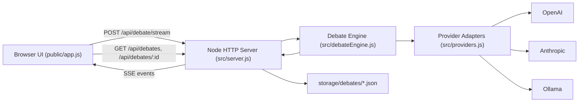

# Dialectic: Two-LLM Debate Studio

Dialectic is a debate-first AI application where two language models argue opposing sides of a question, produce a detailed transcript with evidence anchors, and generate a high-fidelity summary that preserves critical facts and figures.

## Why This Project Exists

Most AI answers are single-threaded: one model, one viewpoint, one final answer. For complex or controversial topics, this often hides uncertainty and alternative interpretations.

Dialectic was built to:

- Force adversarial reasoning (`for` vs `against` / `A` vs `B`).
- Encourage richer evidence use (facts, figures, source hints, case examples).
- Preserve nuance in the final summary instead of blending everything into generic advice.
- Make the reasoning process inspectable via a streaming transcript.

## Core Capabilities

- Two-agent structured debate with alternating turns.
- Supports `Motion` and `A vs B` debate types.
- Pluggable models/providers:
  - OpenAI
  - Anthropic (Claude)
  - Ollama (local)
- Live streaming UI with:
  - per-side thinking indicator
  - incremental turn rendering
- Evidence-dense turn schema:
  - argument text
  - evidence anchors (facts, figure/date, source, reliability)
  - plain-language note
- High-detail summary pipeline:
  - markdown output for humans
  - structured summary object with evidence ledger
- Local archive:
  - save debates as JSON
  - browse and reload old debates from UI

## High-Level Architecture



### Main Components

- `src/server.js`
  - HTTP server, routing, static assets, SSE stream endpoint.
  - Local debate persistence and retrieval APIs.
- `src/debateEngine.js`
  - Debate loop, prompt construction, turn parsing/normalization.
  - Summary generation and structured summary parsing.
- `src/providers.js`
  - Unified completion interface for OpenAI/Anthropic/Ollama.
- `public/index.html`, `public/styles.css`, `public/app.js`
  - Setup form, live transcript rendering, markdown summary view, saved debate browser.

## Prompt Design (How Quality Is Enforced)

The project uses **structured JSON prompts** so output is machine-checkable and consistently information-dense.

### Debater Turn Prompt Requirements

Each turn is asked to return JSON with:

- `argument` (4-8 substantive sentences)
- `hasMore` (continue/stop signal)
- `confidence` (0.0-1.0)
- `angle` (fresh lens for the current round)
- `audienceNote` (plain-language distillation)
- `evidence[]` where each item may include:
  - `type` (`statistic`, `study`, `historical_case`, etc.)
  - `fact`
  - `figureOrDate`
  - `source`
  - `whyItMatters`
  - `reliability`
- `citations[]`

Prompt quality constraints include:

- include concrete facts and at least one number/date when possible
- rebut prior turn content explicitly
- use a new round angle for each side
- avoid repetition (including near-duplicate rephrases)
- include fresh evidence/citation material in continuing rounds
- mark uncertain evidence as uncertain

### Summary Prompt Requirements

The summarizer is asked for strict JSON containing:

- `overview`
- `bestCaseFor[]`
- `bestCaseAgainst[]`
- `evidenceLedger[]` (atomic fact rows with side/source/reliability)
- `convergence[]`
- `openQuestions[]`
- `decisionTakeaway`

This is then transformed into readable markdown while preserving details.

## AI/ML Control Plane (Prompt Engineering + Alignment)

This project uses a **guardrailed generation pipeline** rather than raw free-form prompting. The controls below are intentionally layered to improve consistency, factual density, and side alignment.

### 1) Schema-Constrained Generation

- Uses structured JSON outputs for debater and summarizer turns.
- Enforces required fields like `position`, `angle`, `counterTo`, `evidence[]`, and `citations[]`.
- Applies normalization/parsing fallback (`safeJsonParse`) to recover from minor formatting drift.

Technical term mapping:
- **Constrained decoding interface** (JSON mode / schema-shaped output)
- **Post-generation validation** (server-side checks after model output)

### 2) Role Conditioning + Stance Locking

- Each model is role-conditioned with explicit side identity (`for`/`against` or `A`/`B`).
- Turn validator checks side alignment by requiring:
  - `position` field to match the side exactly.
  - argument prefix `Position defended: <side>.`
  - explicit rebuttal target via `counterTo`.

Technical term mapping:
- **Role-conditioned prompting**
- **Stance-consistency constraints**
- **Rebuttal anchoring**

### 3) Novelty Enforcement (Anti-Repetition)

- Uses lexical similarity heuristics to detect repeated arguments/facts/citations.
- Requires new angle + fresh evidence facts in continuing rounds.
- If novelty fails, triggers revision attempts before hard stop.

Technical term mapping:
- **Iterative self-revision loop**
- **Heuristic novelty gating**
- **Jaccard-style lexical overlap checks**

### 4) Evidence Grounding & Objectivity Bias

- Prompts require evidence anchors (fact, figure/date, source, reliability).
- Validator encourages objective claims by requiring concrete numbers/dates when continuing.
- Argument text must explicitly mention at least one cited source/study when sources exist.
- Weak-certainty claims are labeled with reliability/uncertainty tags.

Technical term mapping:
- **Evidence-grounded generation**
- **Uncertainty calibration**
- **Attribution-aware prompting**

### 5) Termination Policy (When Debate Stops)

- Stop conditions:
  - side reports `hasMore: false`
  - novelty guard fails after rewrite budget
  - both sides exhausted
  - `maxRounds` reached
- `hasMore: false` acts as a **termination signal**; that low-value stop turn is not appended to transcript.
- Metadata still captures stop reason/side, and summary includes stop context.

Technical term mapping:
- **Early stopping policy**
- **Budgeted retry loop**
- **Control-token style stop signaling**

### 6) Hallucination Mitigation Strategy (Practical, Not Absolute)

- Requires source hints, concrete evidence slots, and reliability labels.
- Forces explicit source mention in prose when references are provided.
- Summary preserves atomic facts in an evidence ledger to reduce detail loss.
- No external retrieval/verification is currently built in, so this is a **mitigation layer**, not a proof of factual correctness.

Technical term mapping:
- **Structured anti-hallucination guardrails**
- **Faithfulness-oriented summarization**
- **Non-verifying attribution constraints**

## Debate Lifecycle

1. User submits debate config.
2. Server starts SSE stream.
3. Engine runs alternating turns:
   - emits `thinking` event for side
   - obtains model JSON turn
   - validates stance/novelty/evidence constraints
   - appends normalized turn only for continuing arguments
   - emits `turn` event
4. Loop ends when:
   - either side reports no more arguments (`hasMore: false`), or
   - novelty guard detects no new rebuttal/evidence/angle after rewrite attempts, or
   - both sides exhausted, or
   - `maxRounds` reached
5. Summary phase runs (optional), emits `summary` event.
6. Server emits `complete` event (optionally saves debate).

## Streaming Events (`POST /api/debate/stream`)

SSE event types:

- `start`
- `thinking`
- `turn`
- `summary_thinking`
- `summary`
- `complete`
- `error`

## Data Models

### Transcript Turn (normalized)

```json
{
  "round": 1,
  "side": "for",
  "sideLabel": "For the motion",
  "argument": "...",
  "hasMore": true,
  "confidence": 0.72,
  "position": "For the motion",
  "angle": "Lifecycle cost in dense housing",
  "counterTo": "Opponent claim being rebutted in this turn",
  "citations": ["WHO report 2023"],
  "audienceNote": "Simple interpretation...",
  "evidence": [
    {
      "type": "study",
      "fact": "Observed effect in cohort...",
      "figureOrDate": "2021",
      "source": "Journal Name (2021)",
      "whyItMatters": "Supports mechanism plausibility",
      "reliability": "medium"
    }
  ]
}
```

### Summary Payload

- `summary`: markdown rendering for UI
- `summaryRaw`: raw model response
- `summaryStructured`: parsed JSON summary object (if parseable)

## Storage Model

Saved debate files live in:

- `storage/debates/<id>.json`

Each file contains:

- `id`, `createdAt`
- `request` (sanitized, no API keys)
- `result` (full runtime result payload)
- `debate` (explicit copy of meta/transcript/summary fields)

## Installation

### Prerequisites

- Node.js 18+ (20+ recommended)
- Optional:
  - OpenAI API key
  - Anthropic API key
  - local Ollama instance (if using local models)

### Setup

```bash
cp .env.example .env
```

Populate as needed:

- `OPENAI_API_KEY=...`
- `ANTHROPIC_API_KEY=...`
- optional base URLs:
  - `OPENAI_BASE_URL`
  - `ANTHROPIC_BASE_URL`
  - `OLLAMA_BASE_URL`
- optional runtime:
  - `HOST` (default `127.0.0.1`)
  - `PORT` (default `3000`)

## Running the Project

### Production-like run

```bash
npm start
```

### Dev watch mode

```bash
npm run dev
```

### Syntax checks

```bash
npm run check
node --check public/app.js
```

Open:

- [http://localhost:3000](http://localhost:3000)

## How to Use

1. Choose debate type:
   - `Motion` (for vs against), or
   - `A vs B` (model A vs model B)
2. Enter question and optional A/B labels.
3. Configure model providers for each side.
4. Set `maxRounds`.
5. Optionally:
   - skip summary
   - use separate summary model
   - save debate to local storage
6. Click **Run Debate**.
7. Watch transcript stream in real time and switch to Summary tab.
8. Reload archived debates from Saved Debates panel.

## API Reference

### `GET /api/health`

Health check.

### `GET /api/providers`

Returns provider defaults/placeholders.

### `POST /api/debate`

Runs full debate and returns final payload in one response.

### `POST /api/debate/stream`

Runs debate with SSE streaming.

Example request body:

```json
{
  "debateType": "motion",
  "question": "Is homeopathy an actual science?",
  "maxRounds": 6,
  "forModel": { "provider": "openai", "model": "gpt-5-nano" },
  "againstModel": { "provider": "anthropic", "model": "claude-3-5-sonnet-latest" },
  "skipSummary": false,
  "useSeparateSummaryModel": false,
  "saveDebate": true
}
```

### `GET /api/debates`

Returns saved debate metadata list.

### `GET /api/debates/:id`

Returns one saved debate file payload.

## Configuration Notes

- OpenAI default placeholder is `gpt-5-nano`.
- OpenAI temperature is omitted by default unless explicitly provided per model config.
- Ollama default base URL is `http://localhost:11434`.
- Provider API keys can come from env or UI inputs.

## Extending the Project

Recommended next extensions:

- Add web retrieval + citation verification pipeline (RAG or tool calling).
- Add “judge” model for scoring evidence quality and logical consistency.
- Add token-level streaming from providers where available.
- Add user auth + shared debate workspaces.
- Persist to database (SQLite/Postgres) instead of local JSON files.

## Limitations

- Evidence quality depends on model behavior; source hints are not automatically verified.
- No built-in external web retrieval step yet.
- Summary parser is robust but still depends on model returning parseable JSON.
- Novelty checks are lexical/heuristic and may occasionally flag valid paraphrases.

## Troubleshooting

- `HTTP 400` from provider:
  - verify model name and provider-specific parameter support.
- Empty or weak evidence:
  - increase `maxRounds`, use stronger model, or use separate summarizer.
- Ollama failures:
  - check Ollama is running and model is pulled.
- No saved debates shown:
  - ensure `saveDebate` is enabled and server has write access to `storage/debates`.
